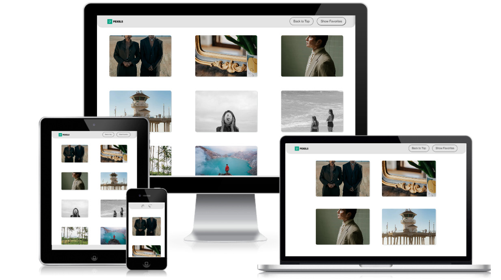

<a name="readme-top"></a>

<div align="center">

</div>

# 📗 Table of Contents

- [📖 About the Project](#about-project)
    - [Tech Stack](#tech-stack)
    - [Key Features](#key-features)
    - [Live Demo](#live-demo)
- [💻 Getting Started](#getting-started)
- [👥 Authors](#authors)
- [🔭 Future Features](#future-features)
- [🤝 Contributing](#contributing)
- [⭐️ Show your support](#support)
- [🙏 Acknowledgements](#acknowledgements)
- [❓ FAQ (OPTIONAL)](#faq)
- [📝 License](#license)

# 📖 Pexels Images React app <a name="about-project"></a>

<br>

The project is a responsive web application that utilizes the Pexels API for retrieving images with metadata. It closely replicates a provided design, including item hover states, and implements infinite scroll for seamless browsing. Users can favorite items, with favorites persisting across page reloads. The application employs React for dynamic UI rendering, adhering to strict limitations on third-party libraries. Styling is custom-built, and images are lazily loaded to optimize performance.


### Tech Stack <a name="tech-stack"></a>

<details>
  <summary>Build with 🛠 </summary>
  <ul>
    <li><a href="https://developer.mozilla.org/en-US/docs/Web/HTML">HTML</a></li>
    <li><a href="https://developer.mozilla.org/en-US/docs/Web/CSS">CSS</a></li>
    <li><a href="https://www.javascript.com/">JavaScript</a></li>
    <li><a href="https://react.dev/">React</a></li>
    <li><a href="https://eslint.org/">ESlint</a></li>
    <li><a href="https://stylelint.io/">Stylelint</a></li>
  </ul>
</details>

### Key Features <a name="key-features"></a>

<br>

- **Integration with Pexels API**: Retrieve images using the Pexels API.
- **Responsive Design**: Optimal viewing experience across different devices with responsive design breakpoints.
- **Infinite Scroll**: Greate browsing experience with the implementation of infinite scroll, loading additional data as the user scrolls down.
- **Favorite Items**: Allow users to mark items as favorites, with favorites persisting across page reloads for a personalized experience.

<p align="right">(<a href="#readme-top">back to top</a>)</p>

## 🚀 Live Demo <a name="live-demo"></a>

<br>

- [Click me to view deployed project!](https://frontend-homework-assignment.onrender.com/)



<p align="right">(<a href="#readme-top">back to top</a>)</p>

## 💻 Getting Started <a name="getting-started"></a>

To get a local copy up and running, follow these steps.

### Prerequisites

In order to run this project you need:

- A Chrome browser
- npm

### Setup

Clone this repository to your desired folder:

```sh
  cd my-folder
  git clone https://github.com/agneta1991/frontend_homework_assignment
```

### Install

Install the prerequisites this project using:

```sh
  cd frontend_homework_assignment
  npm install
  npm run build
```

### Usage

To run the project:

```sh
  npm start
```

### Run tests

To run linter tests please run the following command:

```sh
  npx eslint "**/*.{js,jsx}"
```

```sh
  npx stylelint "**/*.{css,scss}"
```
To run Jest tests please run the following command:

```sh
  npm test
```

## 👥 Author <a name="authors"></a>

<br>

👤 **Agneta Pupienyte**

- GitHub: [@github](https://github.com/agneta1991)
- Twitter: [@twitter](https://twitter.com/pupienytea)
- LinkedIn: [LinkedIn](https://www.linkedin.com/in/agneta-pupienyte-124a27256/?originalSubdomain=lt)

<p align="right">(<a href="#readme-top">back to top</a>)</p>

## 🔭 Future Features <a name="future-features"></a>

<br>

- **Pop-up Window for Full-size Image Display**: Enhance user experience by allowing them to view images at their full size in a pop-up window.
- **Direct Image Download**: Enable users to download images directly from the webpage, providing convenience and flexibility.
- **Image Filtering and Sorting**: Implement features to filter and sort images based on different criteria, enhancing the browsing experience.
- **User Authentication and Profiles**: Introduce user authentication functionality and user profiles, allowing users to save preferences and access personalized content.

<p align="right">(<a href="#readme-top">back to top</a>)</p>

## 🤝 Contributing <a name="contributing"></a>Contributions, issues, and feature requests are welcome!

<br>

Feel free to check the [issues page](https://github.com/agneta1991/frontend_homework_assignment/issues).

<p align="right">(<a href="#readme-top">back to top</a>)</p>

## ⭐️ Show your support <a name="support"></a>

<br>

If you like the project please show your support and give this repo a star!
<br>
<br>
[](https://github.com/agneta1991/frontend_homework_assignment)

<p align="right">(<a href="#readme-top">back to top</a>)</p>

## 🙏 Acknowledgments <a name="acknowledgements"></a>

<br>

<br>

I would like to express my sincere gratitude to Vinted for providing me with the opportunity to work on this take-home assignment. Their commitment to fostering talent and innovation is commendable, and I am grateful for the chance to showcase my skills and contribute to their mission. I appreciate the trust they have placed in me and look forward to the possibility of collaborating further in the future.


<p align="right">(<a href="#readme-top">back to top</a>)</p>
<br>

## 📝 License <a name="license"></a>

This project is [MIT](./LICENSE) licensed.
